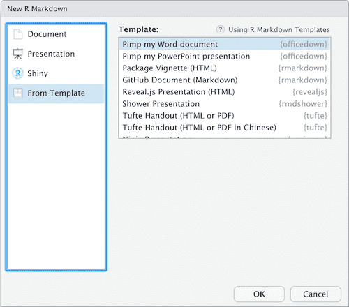
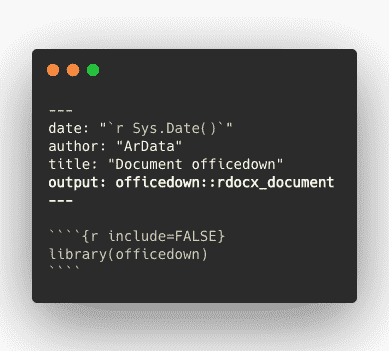
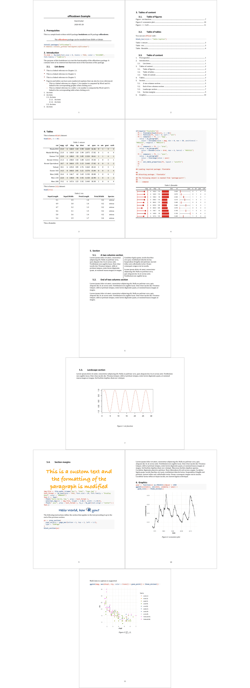

<!-- README.md is generated from README.Rmd. Please edit that file -->

[](https://travis-ci.org/davidgohel/officedown)
[](https://ci.appveyor.com/project/davidgohel/officedown)
[](https://www.tidyverse.org/lifecycle/#experimental)
[](https://cran.r-project.org/package=officedown)

> `officedown` is bringing some
> [officer](https://cran.r-project.org/package=officer) features into R
> markdown documents.

## Overview

The package facilitates the formatting of Microsoft Word documents
produced by R Markdown documents by providing a range of features:

<a href="https://github.com/davidgohel/officedown"></a>

  - Compatibility with the functions of the package `officer` for the
    production of “runs” and “blocks” of content (text formatting,
    landscape mode, tables of contents, etc.).
    
    You can add a column break in a two-column section, you can easily
    color a chunk of text, you can add tables of contents at any place
    in the document and also add a list of figures or list of tables.

  - Ability to use the table styles and list styles defined in the
    “reference\_docx” which serves as a template for the pandoc
    document.
    
    With rmarkdown, you can reuse all paragraph styles. With officedown,
    you can also reuse table and list styles. These features are based
    on the use of Word templates (`reference_docx`). It is recommended
    to learn how “Word styles” work for paragraphs, tables and lists if
    you never really used Word styles.
    
    > These styles are to be defined in a Word document that serves as a
    > template. You must first create a Word document (or edit an
    > existing Word document), adjust the styles and save it. This
    > document which serves as a vehicle for the defined styles will be
    > used by R Markdown, the argument `reference_docx` must be filled
    > in with the file path.

  - The replacement of captions (tables, figures and standard
    identifiers) by captions containing a Word bookmark that can be used
    for cross-referencing. Also the replacement of cross-references by
    cross-references using fields calculated by Word. The syntax
    conforms to the bookdown cross-reference definition.
    
    The package transforms some specific knitr codes into references
    calculated by Word, it applies to:
    
      - cross-references with bookdown syntax
      - table and image captions
      - title identifiers
    
    > It is then easy to copy and paste the content into another
    > document without losing the reference numbers. Captions are also
    > auto-numbered by Word.

## Installation

You can install officedown from github with:

``` r
remotes::install_github("davidgohel/officedown")
```

Supported formats require some minimum
[pandoc](https://pandoc.org/installing.html) versions:

|    R Markdown output | pandoc version |
| -------------------: | :------------: |
|       Microsoft Word |    \>= 2.0     |
| Microsoft PowerPoint |    \>= 2.4     |

## Getting started

### rdocx\_document

use RStudio Menu to create a document from `officedown` template.



It creates an R markdown document, parameter `output` is set to
`officedown::rdocx_document`. Note that package `officedown` need to be
loaded in the Rmd.



## Features illustration

A bookdown is available in the package and can be used as a demo.

``` r
dir <- system.file(package = "officedown", "example", "bookdown")
file.copy(dir, getwd(), recursive = TRUE, overwrite = TRUE)
rmarkdown::render_site("bookdown")
browseURL("bookdown/_book/bookdown.docx")
```

You should see the following document:



## Default settings

The package is using global settings, they are to be used for
customization of tables, lists, plots, captions, …

Default values are presented below in their YAML format.

``` yaml
# full default yaml header
output: 
  officedown::rdocx_document:
    tables:
      style: Table
      layout: autofit
      width: 1.0
      caption:
        style: Table Caption
        pre: 'Table '
        sep: ': '
      conditional:
        first_row: true
        first_column: false
        last_row: false
        last_column: false
        no_hband: false
        no_vband: true
    plots:
      style: Normal
      align: center
      caption:
        style: Image Caption
        pre: 'Figure '
        sep: ': '
    lists:
      ol.style: null
      ul.style: null
```

Default values are detailled in the help page of `rdocx_document`, see
details with command:

``` r
?officedown::rdocx_document
```
